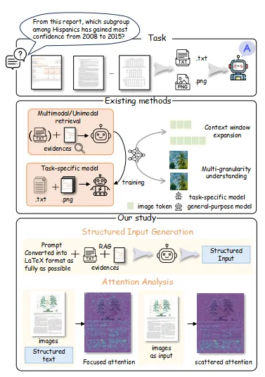

<p align="center" width="100%">
<!-- <a target="_blank"></a>
</p> -->

# Structured Attention Matters to Multimodal LLMs in Document Understanding


<div align="center">
  <div class="is-size-5 publication-authors" style="font-size: 18px;">
    <!-- Paper authors -->
    <span class="author-block">
      <a href="THIRD AUTHOR PERSONAL LINK" target="_blank">Chang Liu</a><sup>1</sup>,</span>
    <span class="author-block">
      <a href="SECOND AUTHOR PERSONAL LINK" target="_blank">Hongkai Chen</a><sup>1†</sup>,</span>
    <span class="author-block">
      <a href="https://vanoracai.github.io/" target="_blank">Yujun Cai</a><sup>2</sup>,</span>
    <span class="author-block">
      <a href="https://wuhang03.github.io/" target="_blank">Hang Wu</a><sup>1,3</sup>,</span>
    <span class="author-block">
      <a href="THIRD AUTHOR PERSONAL LINK" target="_blank">Qingwen Ye</a><sup>1</sup>,</span>
    <span class="author-block">
      <a href="https://faculty.ucmerced.edu/mhyang/" target="_blank">Ming-Hsuan Yang</a><sup>3</sup>,</span>
    <span class="author-block">
      <a href="https://wangywust.github.io/" target="_blank">Yiwei Wang </a><sup>3</sup>,</span>
  </div>

  <div class="is-size-5 publication-authors" style="font-size: 18px;">
    <span class="author-block"><sup>1</sup>vivo Mobile Communication Co., Ltd
      <sup>2</sup>The University of Queensland,
     <br><sup>3</sup>University of California, Merced
    </span>
    <span class="eql-cntrb"><small><br><sup>†</sup>Indicates Corresponding Author</small></span>
  </div>
</div>


<div style='display: flex; gap: 0.25rem; justify-content: center; text-align: center;' align="center">
  <!-- <a href='LICENCE'></a> -->
  <a href='https://arxiv.org/abs/2506.21600'></a>
  <!-- <a href='https://wuhang03.github.io/DiMo-GUI-homepage/'></a> -->
  <!-- <a href='https://twitter.com/Leon_L_S_C'></a> -->
</div>

## 🔥 Update
<!-- * [2024-04-05]: ⭐️⭐️⭐️ VCD is selected as Poster Highlight in CVPR 2024! (Top 11.9% in accepted papers)
* [2023-11-29]: ⭐️ Paper of VCD online. Check out [this link](https://arxiv.org/abs/2311.16922) for details. -->
* [2025-06-18]: 🚀 Codes released.

## 🎯 Overview
<div align="center">
    
</div>

- We investigate the significance of structured input in document understanding and propose a simple yet effective method to preserve textual structure. By reformatting the input, we enhance the document comprehension capabilities of multimodal large language models (MLLMs). Furthermore, through attention analysis, we explore the underlying reasons for the importance of structured input.

- The key contributions of this work are:

  1. Efficient Structure-Preserving Method: We introduce a structure-preserving approach that leverages LaTeX formatting to provide structured input for MLLMs.

  2. Attention Analysis: We demonstrate that structured input leads to structured attention patterns, thereby improving model performance.

  3. Multimodal Structured Input: We show that structured inputs—for both text and images—are essential to achieving structured attention across modalities, ultimately boosting overall performance.


<div align="center">
    
</div>

- Extensive and comprehensive experiments demonstrate that our structure-preserving method can significantly enhance document understanding performance by merely changing the input format, and subsequent attention analysis showcases the importance of structured input.


## 🕹️ Usage
### Environment Setup
```bash
conda env create -n structureM python=3.12
source activate structureM
cd structure-matters
bash install.sh
```

<!-- 
Note that the transformers version required by osatlas-4b is different from others, you need to run the following command to run osatlas-4b:
```bash
pip install transformers==4.37.2
``` -->

### Data Preparation
- Create a data directory:
```bash
mkdir data
cd data
```
- Download the dataset from huggingface [link](https://huggingface.co/datasets/Lillianwei/Mdocagent-dataset) and place it in the data directory. You can use symbol link or make a copy

- Return to the project root:
```bash
cd ../
```

- Extract the data using:
```bash
python scripts/extract.py --config-name <dataset>  # (choose from mmlb / ldu / ptab / feta)
```
The extracted texts and images will be saved in ./tmp/<dataset>.


**Note:** For all experiments: `<dataset>` should choose from (mmlb / ldu / ptab / feta), `<run-name>` can be any string to uniquely identify this run (required).

<!-- ### Transfer OCR text into structured text

```bash
python scripts/structure_transform.py --config-name <dataset> run-name=<run-name>  
``` -->


### Run the following command to generate answers with different input
For MMLongBench and LongDocUrl, which have ground truth retrieval results, use the following command to run different experiments.

For all experiments: \<dataset> should choose from mmlb/ldu, \<run-name> can be any string to uniquely identify this run (required).
- Use image as input:
Modify the `input_type` parameter in `config/base.yaml` to set different input formats.  
### Choose from: `structured-input` / `image` / `image-text`


```bash
python scripts/predict.py --config-name <dataset> run-name=<run-name>  
```

### Attention Analysis for Single and Multiple Samples
```bash
python scripts/attention_analysis.py --config-name <dataset> run-name=<run-name>  
```
**Note:** This project provides some question samples from MMLongBench for generating heatmaps.  
These samples are located in `./results/MMLongBench/images_question_for_heat_map.json`.  
Before generating the heatmap, you need to obtain the corresponding structured text of each sample and pass it as an input parameter.


## 🏅 Experiments
<!-- - **Comparison of various models with different input format on different datasets.**
<div align="center">
    
</div> -->

- **Comparison of various models with text/structured text on different datasets**
<div align="center">
    
</div>

- **Comparison of various models with structured text on different subsets of MMLongBench**
<div align="center">
    
</div>

- **Please refer to [our paper](https://arxiv.org/abs/2506.21600) for detailed experimental results.**


<!-- ## 📌 Examples
<div align="center">
    
</div>

- **Case study:** On the left is the image needed to be input into MLLMs, where the red box represents the ground truth and the blue dot indicates the predicted coordinates. On the right is the result after integrating DiMo-GUI, where the model is able to localize more accurately according to the instruction -->


<!-- <div align="center">
    
</div>

- **Examples on ScreenSpot-V2.** On the Screenspot benchmark, which features relatively low resolution and simple scenes, DiMo-GUI also enhances the model's localization capabilities. -->


## 📑 Citation
If you find our project useful, we hope you can star our repo and cite our paper as follows:
```
@article{liu2025structured,
  title={Structured Attention Matters to Multimodal LLMs in Document Understanding},
  author={Liu, Chang and Chen, Hongkai and Cai, Yujun and Wu, Hang and Ye, Qingwen and Yang, Ming-Hsuan and Wang, Yiwei},
  journal={Authorea Preprints},
  year={2025},
  publisher={Authorea}
}
```


## 📝 Related Projects
Our repository is based on the following projects, we sincerely thank them for their great efforts and excellent work.
- [MDocAgent](https://github.com/aiming-lab/MDocAgent): latest multi-agent document understanding framework.


## License

This project is licensed under the terms of the Apache License 2.0.
You are free to use, modify, and distribute this software under the conditions of the license. See the LICENSE file for details.# StructureMatters
